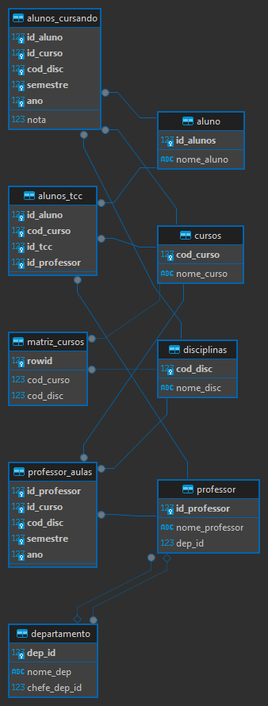

# Projeto-Banco-de-Dados

ALUNOS:
Caue Jacomini Zanatti - 22.122.024-7

Vinicius Henrique - 22.122.063-5

Instruções de uso:

1.Executar o arquivo Tables.sql completo, ele criará todas as tabelas que serão utilizadas no projeto.

2.Executar o arquivo generator.py, que gerará aleatoriamente todos os inserts que serão randomizados com informações de alunos, professores e etc (Vale notar que botei um sleep de 5 segundos entre os prints de insert, para não spamar de uma vez).

3.Abrir o arquivo Inserts.sql, e inserir as informações que foram geradas a partir do arquivo python nas posições corretas. Algumas informações "estáticas" já foram inseridas no arquivo, para que como um todo ele o banco faça sentido.

4.Executar o arquivo Inserts.sql

5.Executar o arquivo selects.sql, que terá todos os selects que foram pedidos.

Diagrama relacional:

